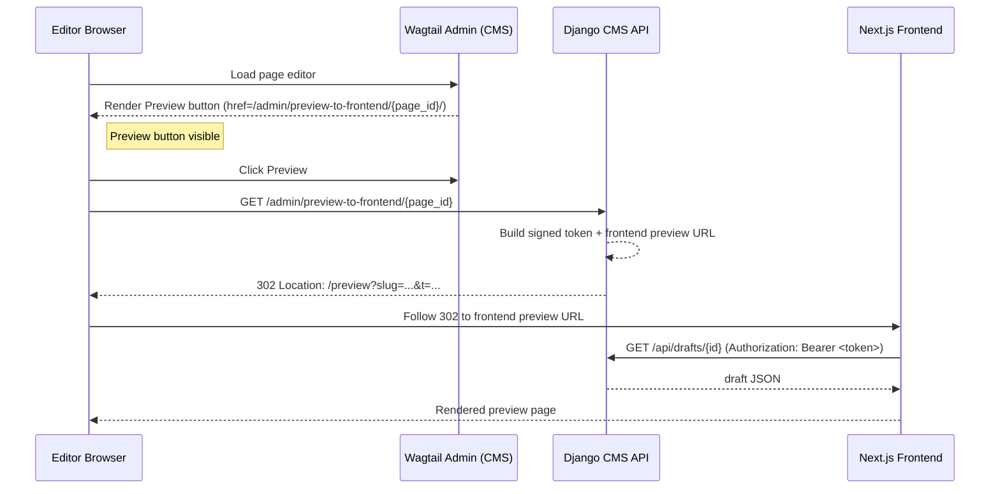

# CDD-1379 - Page Previews

**Date:** 2026-02-27

**Ticket:** https://ukhsa.atlassian.net/browse/CDD-1379?search_id=055fe61d-bee9-48d9-80bc-ffb0f1c26b76&referrer=quick-find

**Authors:** Jean-Pierre Fouche

**Impact:** Affects all pages - broad testing required

**Testing:** Comprehensive unit tests supplied.  UAT needed.


## Summary

Allow editors of headless composite pages to click a **Preview** button that immediately redirects them to the external frontend application, rather than opening the built-in Wagtail iframe preview.  Preview URLs include a short-lived signed token so the frontend can safely fetch draft content from the CMS.

## Workflow

- Editors see a custom "Preview" button in the CMS if the page type allows previews.
- When clicked, the CMS generates a short-lived, signed token and redirects the editor’s browser to the frontend preview URL with this token.
- The frontend uses the token to securely fetch the latest draft content from the CMS via a special API endpoint.
- The API validates the token (including expiry and page ID) before returning draft content.
- Preview enablement is controlled by a flag on each page type.
- The system avoids Wagtail’s built-in iframe preview, using external redirects and API calls for a secure, modern preview experience.
- Security is enforced by short token lifetimes, HMAC signing, and requiring tokens in Authorization headers for API access.

## Architecture

### Component Flow Diagram



### Security

- **Token TTL**: 120-second expiry limits exposure window
- **HMAC signing**: Tokens cryptographically signed, cannot be forged
- **Salt isolation**: Preview tokens use dedicated salt, separate from session tokens
- **Bearer vs querystring**: Token transmitted in Authorization header to API (reduces logging exposure), though initially passed via querystring in redirect (acceptable for short-lived tokens)
- **Prevention of replay attacks**: Each token includes `iat` timestamp and specific `page_id`, limiting reuse scope

## Environment Variables

Set these up in an environment file (such as env.local)
(These are defined with default values in default.py and local.py)

```bash
PAGE_PREVIEWS_ENABLED = False # Allows the server to disable or enable page previews
PAGE_PREVIEWS_FRONTEND_BASE_URL = 'http://localhost:3000' # The base URL for the front-end application.  Allows the CMS to send the browser to the frontend on the click of a button.
PAGE_PREVIEWS_FRONTEND_URL_TEMPLATE = "http://localhost:3000/preview?slug={slug}&t={token}" # The format of the URL redirect that will be sent to the Front End
PAGE_PREVIEWS_TOKEN_TTL_SECONDS = 86400 #  The front end receives a presigned url.  This setting defines the token expiry window.  It is recommended to keep this as low as possible, and can possibly be set to as low as 60 seconds, the time it takes for the front end to render the page.  Default is 120 seconds.
PAGE_PREVIEWS_TOKEN_SALT = 'preview-token' # Salt string - adds an extra layer of security into the generation of the token.
```

## Files Changed

| File Name | Purpose of Change | Process (Inputs, Process, Outputs, Example) |
|-----------|------------------|---------------------------------------------|
| cms/common/models.py | Added preview support and improved related link logic for common pages, enabling editors to preview unpublished changes and manage related links more flexibly. | **Input:** Page instance.<br>**Process:** Adds preview fields and related link handling.<br>**Output:** CommonPage with preview and links.<br>**Example:** Input: CommonPage; Output: Previewable CommonPage. |
| cms/composite/models.py | Enhanced composite pages with preview, pagination, and related link support, allowing editors to preview drafts and control page navigation. | **Input:** CompositePage instance.<br>**Process:** Adds preview, pagination, and related link fields.<br>**Output:** CompositePage with preview and pagination.<br>**Example:** Input: CompositePage; Output: Previewable CompositePage. |
| cms/dashboard/models.py | Centralized preview enablement and shared logic for all dashboard pages, standardizing how preview is toggled and managed across page types. | **Input:** Dashboard page instance.<br>**Process:** Adds preview flags and shared logic.<br>**Output:** Dashboard pages with preview toggle.<br>**Example:** Input: UKHSAPage; Output: Preview-enabled UKHSAPage. |
| cms/dashboard/serializers.py | Extended serializers to support draft and published page data for the API, ensuring frontend receives correct structure for previews. | **Input:** Page instance.<br>**Process:** Serializes fields for frontend preview.<br>**Output:** JSON page data.<br>**Example:** Input: Draft page; Output: `{ "id": 123, "title": "COVID-19" }` |
| cms/dashboard/templates/wagtailadmin/pages/action_menu/frontend_preview.html | New template for the Preview button in Wagtail admin, providing a clear call-to-action for editors to preview content externally. | **Input:** Button context (label, url, etc).<br>**Process:** Renders button HTML.<br>**Output:** Preview button in admin.<br>**Example:** Input: label="Preview", url="/admin/preview/1"; Output: Button HTML. |
| cms/dashboard/views.py | Added secure redirect logic to generate signed preview tokens and forward editors to the frontend preview, enforcing permissions and token expiry. | **Input:** GET `/admin/preview-to-frontend/{page_id}/`.<br>**Process:** Checks permissions, signs token, builds URL.<br>**Output:** 302 redirect to frontend.<br>**Example:** Input: Page ID 123; Output: Redirect to preview URL. |
| cms/dashboard/viewsets.py | Implemented API endpoint to serve draft content to the frontend, validating signed tokens and supporting secure preview of unpublished changes. | **Input:** GET `/api/drafts/{id}` with Bearer token.<br>**Process:** Validates token, fetches draft.<br>**Output:** JSON draft page.<br>**Example:** Input: Bearer token for page 123; Output: Draft JSON. |
| cms/dashboard/wagtail_hooks.py | Registered preview button, admin URLs, and menu actions in Wagtail, integrating the preview workflow into the CMS UI and admin menus. | **Input:** Page edit context.<br>**Process:** Adds preview button/action, registers redirect endpoint.<br>**Output:** Preview button and redirect URL.<br>**Example:** Input: Editor clicks Preview; Output: Redirect to frontend. |
| cms/home/models/landing_page.py | Enabled preview and related link support for landing pages, so editors can review unpublished changes and manage links. | **Input:** LandingPage instance.<br>**Process:** Adds preview and related link fields.<br>**Output:** LandingPage with preview.<br>**Example:** Input: LandingPage; Output: Previewable LandingPage. |
| cms/topic/models.py | Enabled preview and related link support for topic pages, improving editorial workflow for draft content and navigation. | **Input:** TopicPage instance.<br>**Process:** Adds preview and related link fields.<br>**Output:** TopicPage with preview.<br>**Example:** Input: TopicPage; Output: Previewable TopicPage. |
| config.py | Added and documented preview/token settings and environment variables, ensuring correct configuration for secure preview flows. | **Input:** Env variables.<br>**Process:** Loads/sets preview config.<br>**Output:** Config values for preview/token.<br>**Example:** Input: PAGE_PREVIEWS_ENABLED; Output: True/False. |
| metrics/api/settings/default.py | Set default preview/token and API settings, providing baseline security and feature toggles for preview functionality. | **Input:** Default settings.<br>**Process:** Sets preview/token defaults.<br>**Output:** Default config for preview/token.<br>**Example:** Input: PAGE_PREVIEWS_TOKEN_TTL_SECONDS; Output: 120. |
| metrics/api/settings/local.py | Overrode preview/token settings for local development, making it easier to test preview features in dev environments. | **Input:** Local settings.<br>**Process:** Overrides preview config.<br>**Output:** Local config for preview/token.<br>**Example:** Input: PAGE_PREVIEWS_ENABLED; Output: True. |
| scripts/_quality.sh | Bug fix - return replaces exit, thus keeping the current shell open. |

