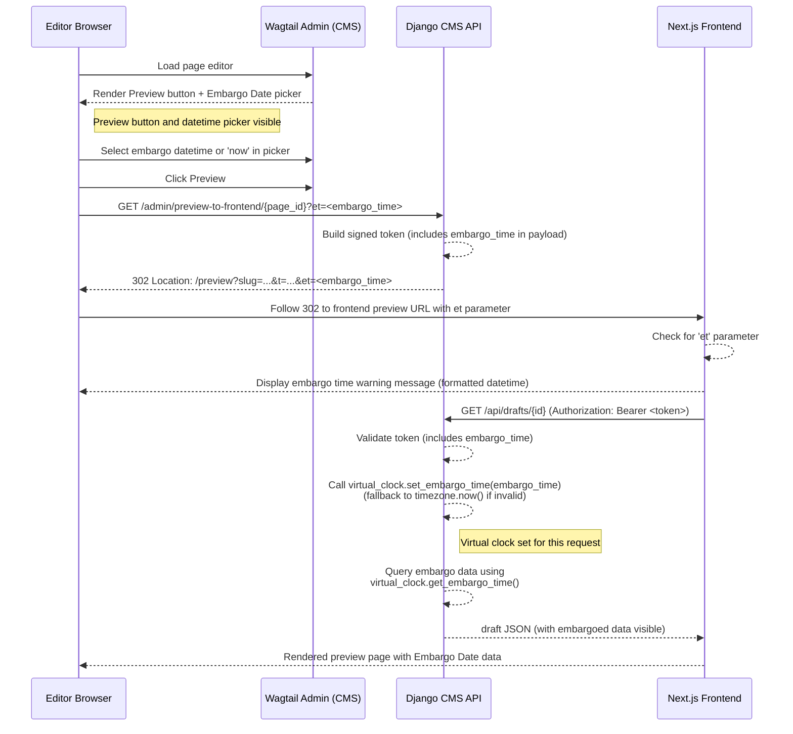
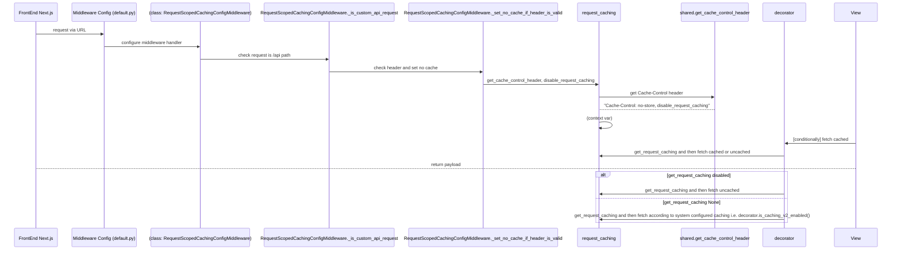

# CDD-1379 - Page Previews

**Date:** 2026-02-27

**Ticket:** https://ukhsa.atlassian.net/browse/CDD-1379?search_id=055fe61d-bee9-48d9-80bc-ffb0f1c26b76&referrer=quick-find

**Authors:** Jean-Pierre Fouche

**Impact:** Affects all pages - broad testing required

**Testing:** Comprehensive unit tests supplied.  UAT needed.


## Summary

Allow editors of headless composite pages to click a **Preview** button that immediately redirects them to the external frontend application, rather than opening the built-in Wagtail iframe preview.  Preview URLs include a short-lived signed token so the frontend can safely fetch draft content from the CMS.

Additionally, allow users to select to set "Embargo Date" by selecting a virtual date in order to preview otherwise embargoed data.

## Workflow

- Editors see a custom "Preview" button in the CMS if the page type allows previews.
- When clicked, the CMS generates a short-lived, signed token and redirects the editor’s browser to the frontend preview URL with this token.
- The frontend uses the token to securely fetch the latest draft content from the CMS via the drafts API endpoint.
- The API validates the token (including expiry and page ID) before returning draft content.
- Preview enablement is controlled by a flag on each page type.
- The system avoids Wagtail’s built-in iframe preview, using external redirects and API calls for a secure, modern preview experience.
- Security is enforced by short token lifetimes, HMAC signing, and requiring tokens in Authorization headers for API access.
- Should the user wish to set "Embargo Date" to view embargoed data, a datetime picker is available next to the Preview button.  Upon selecting a datetime, the embargo time is sent to the frontend both as a querystring parameter (for display purposes) and as a key-value in the encrypted token payload, which is sent to the CMS.  Conditional upon a valid auth token, the CMS is able to `set_embargo_time`, using a "virtual clock".  All embargo queries are now designed to use the virtual clock, rather than timezone.now().  The function `virtual_clock.set_embargo_time` falls back to timezone.now().

## Deployment

IMPORTANT: We MUST set the environment variables defined below, particularly, 

```bash
FRONTEND_URL
PAGE_PREVIEWS_ENABLED
```
See the section on environment variables, below.

## Architecture

### Component Flow Diagram



### Embargo Date Picker

This feature allows editors to preview content and data at a virtual point in time, largely without changing the logic within components.  This works by substituting calls to timezone.now() within embargo components with a call to `virtual_clock.get_embargo_time`.

- This works only if with `PAGE_PREVIEWS_ENABLED=true`
- In the CMS, the editor selects either a specific datetime or `now` from the Embargo Date picker.
- On Preview, the redirect API includes the embargo time as `et` in the frontend redirect querystring.
- At the time of writing, the frontend reads `et` and shows a warning/banner that the page is being viewed in Embargo Date mode, including a formatted date and time.
- The API validates the preview token before applying any virtual time.
- If the token is valid and contains embargo time information, the backend calls `virtual_clock.set_embargo_time(embargo_time_value: object, *, token: str)` for that request.
- If no valid embargo time is present, or the token is invalid, the clock logic falls back to `timezone.now()`.
- All embargo-aware components resolve the effective datetime through `virtual_clock.get_embargo_time()`, ensuring consistent behavior across queries.
- By means of a call to `_with_embargo_time(data: dict, embargo_time: int | None)`, the page is rendered, along with an additional field, `"embargo_time"`.  The consumer has the option to inspect this for its own purposes. 

### Caching

- Page previews allows for caching on demand. This is effected by inspecting the `Cache-Control` headers passed in a request.
- Should `Cache-Control: no-store` be present in an API call (this functionality is restricted to the metrics api), there will be a cache "miss", under which all responses will be calculated afresh, bypassing the cache.
- This functionality endures for the duration of the request and is isolated to the request.  No other requests will be affected as the configuration is scoped within the `context` (broadly speaking, the thread) of the request.  
- This functionality has been implemented using [ContextVar](https://docs.python.org/3/library/contextvars.html) and keeps the codebase interfaces largely untouched.  This keeps caching concerns orthogonal to the application logic, following the original caching design.




### Security

- **Token TTL**: 30-second expiry limits exposure window.  This is configurable - we are estimating a max 30 second window for the round-trip transaction for the CMS to obtain a redirect URL and for the front-end to fetch its data.
- **HMAC signing**: Tokens cryptographically signed, cannot be forged
- **Salt isolation**: Preview tokens use dedicated salt, separate from session tokens.  The salt is deterministically generated along with the Django `SECRET_KEY`.  Note: every worker instance must use the same salt, so as to avoid user-request inconsistencies.
- **Bearer vs querystring**: Token transmitted in Authorization header to API (reduces logging exposure), though initially passed via querystring in redirect (acceptable for short-lived tokens)
- **Prevention of replay attacks**: Each token includes `iat` timestamp and specific `page_id`, limiting reuse scope

## Environment Variables

Set these up in an environment file (such as env.local)
(These are defined with default values in default.py and local.py)

```bash
PAGE_PREVIEWS_ENABLED = False # Allows the server to disable or enable page previews
FRONTEND_URL = 'http://localhost:3000' # The base URL for the front-end application.  Allows the CMS to send the browser to the frontend on the click of a button.  This variable has no default value - you must provide a value in a .env file.
PAGE_PREVIEWS_TOKEN_TTL_SECONDS = 30 #  The front end receives a presigned url.  This setting defines the token expiry window.  It is recommended to keep this as low as possible, and can possibly be set to as low as 30 seconds, the time it takes for the front end to render the page.  Default is 30 seconds.  It is recommended to set this to a higher threshold in development environments (e.g. 86400, which is 24 hours).
```

