# CDD-3293-CMS-FIX-Dual-category-chart-component

# Author
Jean-Pierre Fouche

# Ticket
[CDD-3293-CMS-FIX-Dual-category-chart-component](https://ukhsa.atlassian.net/browse/CDD-3293)

# Date
26 May 2026

# Description

This change fixes the issue described in the above ticket. 

Dual Category Charts are managed in the Wagtail CMS admin interface with two important fields:

```mermaid
graph TD
xaxis["x-axis"] --> | links to | PrimaryFieldValues["Primary Field Values</br>(single multi-select <select> element)"] 
SecondCategory["Second Category"] --> | links to | DualChartSegments["Dual Chart Segments</br>(multiple <select> elements)"]
```

# Expected Behaviour

When the x-axis field is selected for a particular "primary category" e.g. "geography", the Primary Field Values `<select>` element should display only the appropriate regions e.g. Wales, Scotland etc.

Similarly, when the Secondary Category is selected, the individual `<select>` elements in each "segment" must be updated accordingly to show the related options.  

There are in effect two sets of values, one for the category ("x-axis" / "Secondary Category") and one for the sub category selectors. The x-axis and Secondary Category selectors both use the same options in each case.

# Fix

## Isolate CSS Queries to Chart Scope

CSS queries have been modified to stay within the scope of the root node in which the chart has been created, thus doing away with `document.getElementById` and the like.
We now do (for example) `rootNode.querySelector` and this keeps the queries to the right chart.

## DualCategoryChartCardBlockDefinition behaves as a singleton

`DualCategoryChartCardBlockDefinition` has been changed to create chart instancesm using a new class, `DualCategoryChartCardBlock`.  This fixes the issue of leakage between two instances of "Dual Category Chart". 
