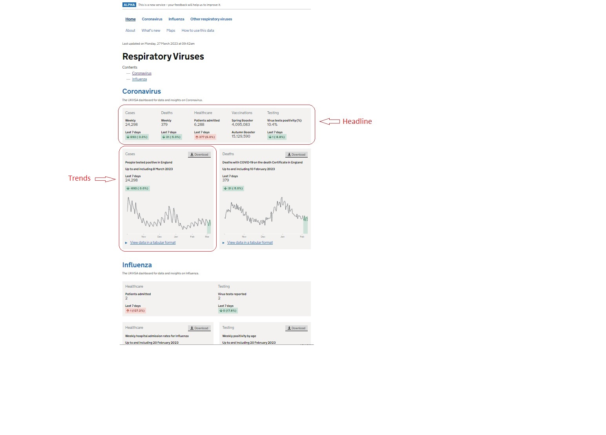

# REST Schema Document

## Introduction

This document details both the existing and planned endpoints. The schema documentation available at the `/redoc/` or `/swagger/` endpoints provides a nice summary of what is available.

---

## Deprecated endpoints

The following endpoints were built for the Alpha release and as such are now deprecated

- `/api/pages/` Retrieve CMS page content. Will be replaced by a dynamic equivalent. See below

- `/api/stats/` Retrieve all statistics for a particular topic. Will be replaced by a dynamic equivalent. See below

- `/timeseries/` Retrieve timeseries data for the specified parameters. Will not be replaced

- `/charts/` Retrieve a chart (in png/jpg format) for a given topic and category. Will be replaced by a dynamic equivalent. See below

- `/tabular_data/` Retrieve summary chart data in tabular format. Will be replaced by a dynamic equivalent. See below

- `/upload/` will not be replaced

<br />

---
## Internal Use Only Endpoints

The following endpoints are for admin/internal use only

- `/admin/` To administer the Django site

- `/cms-admin/` For maintaining the CMS content

- `/health/` For checking the health of the site

<br />

## Active Endpoints

--- 
<br />

The following endpoints are used to construct a page similar to this:


*__Figure 1__*

--- 
<br />

- `/api/pages/v2/{topic/id}`

This endpoint retrieves from the CMS the page content for the chosen topic/id. It includes all the associated information to enable the user to construct api requests for the rest of the items on the page. For example, the parameters needed for the requests to the metrics and graphs endpointsare in this response.

Example Response:

```
[
    {"type": "text", "body": "<body>\n Data and insights from the UKHSA on respiratory viruses\n</body>"},
    {"type": "text", "body": "<h2>Coronavirus</h2>\n The UKHSA dashboard for data and insights on coronavirus."},
    {
        "type": "headline_column",
        "body": "<body><h3>Cases</h3>",
        "headline": [
            {
                "type": "basic",
                "body": "<b>Weekly</b>",
                "params": {
                    "topic": "COVID-19",
                    "metric": "new_cases_7days_sum",
                    "geography_type": "Nation",
                    "geography": "England",
                    "stratum": "default",
                    "sex": "ALL",
                },
            },
            {
                "type": "trend",
                "body": "<b>Last 7 days</b>",
                "params": {
                    "topic": "COVID-19",
                    "metric": "new_cases_7days_change",
                    "geography_type": "Nation",
                    "geography": "England",
                    "stratum": "default",
                    "sex": "ALL",
                },
            },
        ],
    },
    {"type": "headline_column", "body": "<body><h3>Deaths</h3>", ...},
    {"type": "headline_column", "body": "<body><h3>Healthcare</h3>", ...},
    {"type": "headline_column", "body": "<body><h3>Vaccines</h3>", ...},
    {"type": "headline_column", "body": "<body><h3>Testing</h3>", ...},
    {
        "type": "chart_card",
        "body": "<body><h3>Cases</h3>\n <b>Positive tests reported in England</b>\n Up to and including 25 February 2023</body>",
        "chart": {
            "params": {
                "topic": "COVID-19",
                "metric": "new_cases_daily",
                "chart_type": "line_with_shaded_section",
                "date_from": "2022-10-01",
            },
            "body": "",
        },
        "tabular": {
            "params": {
                "topic": "COVID-19",
                "metric": "new_cases_daily",
                "geography_type": "Nation",
                "geography": "England",
                "stratum": "default",
                "sex": "ALL",
                "date_from": "2022-10-01",
            },
            "body": "",
        },
        "headline": [
            {
                "type": "basic",
                "body": "<b>Last 7 days</b>",
                "params": {
                    "topic": "COVID-19",
                    "metric": "new_cases_7days_sum",
                    "geography_type": "Nation",
                    "geography": "England",
                    "stratum": "default",
                    "sex": "ALL",
                },
            },
            {
                "type": "trend",
                "body": "",
                "params": {
                    "topic": "COVID-19",
                    "metric": "new_cases_7days_change",
                    "geography_type": "Nation",
                    "geography": "England",
                    "stratum": "default",
                    "sex": "ALL",
                },
            },
        ],
    },
]

```
*__Figure 2__*

<br />

## As can be seen in Figure 2 above there are several sections in the response:

<br />

### The `headline_column` section

```
    {
        "type": "headline_column",
        "body": "<body><h3>Cases</h3>",
        "headline": [
          {
                "type": "basic",
                "body": "<b>Weekly</b>",
                "params": {
                    "topic": "COVID-19",
                    "metric": "new_cases_7days_sum",
                    "geography_type": "Nation",
                    "geography": "England",
                    "stratum": "default",
                    "sex": "ALL",
                },
            },
            {
                "type": "trend",
                "body": "<b>Last 7 days</b>",
                "params": {
                    "topic": "COVID-19",
                    "metric": "new_cases_7days_change",
                    "geography_type": "Nation",
                    "geography": "England",
                    "stratum": "default",
                    "sex": "ALL",
                },
            },
        ],
    },``
```
*__Figure 3__*

The `headline_column` section is used to construct elements in the __Headline__ Panel as shown in Figure 1 above.

In this example (Figure 3) there are two __type__ elements:

1. __basic__ In this example it is __Cases__ and __Weekly__  (see the *body* tags)
2. __trend__ In this example it is __Cases__ and __Last 7 days__

The `params` section in the __basic__ type are to be used as the paramaters for calls to the `/api/headlines/v2/` endpoint.
```
                 "topic": "COVID-19",
                 "metric": "new_cases_7days_sum",
                 "geography_type": "Nation",
                 "geography": "England",
                 "stratum": "default",
                 "sex": "ALL",

```
So, the API call to retrieve this headline information would be `/api/headlines/v2/?topic=COVID-19&metric=new_cases_7days_sum&geography_type=.....` etc

The `params` section in the __trend__ type are to be used as the paramaters for calls to the `/api/trends/v2/` endpoint.

```
                 "topic": "COVID-19",
                 "metric": "new_cases_7days_change",
                 "geography_type": "Nation",
                 "geography": "England",
                 "stratum": "default",
                 "sex": "ALL",
```

So, the API call to retrieve this trend information would be `/api/trends/v2/?topic=COVID-19&metric=new_cases_7days_change&geography_type=.....` etc


### The `chart_card` section
```
        "type": "chart_card",
        "body": "<body><h3>Cases</h3>\n <b>Positive tests reported in England</b>\n Up to and including 25 February 2023</body>",
        "chart": {
            "params": {
                "topic": "COVID-19",
                "metric": "new_cases_daily",
                "chart_type": "line_with_shaded_section",
                "date_from": "2022-10-01",
            },
            "body": "",
        },
        "tabular": {
            "params": {
                "topic": "COVID-19",
                "metric": "new_cases_daily",
                "geography_type": "Nation",
                "geography": "England",
                "stratum": "default",
                "sex": "ALL",
                "date_from": "2022-10-01",
            },
            "body": "",
        },
        "headline": [
            {
                "type": "basic",
                "body": "<b>Last 7 days</b>",
                "params": {
                    "topic": "COVID-19",
                    "metric": "new_cases_7days_sum",
                    "geography_type": "Nation",
                    "geography": "England",
                    "stratum": "default",
                    "sex": "ALL",
                },
            },
            {
                "type": "trend",
                "body": "",
                "params": {
                    "topic": "COVID-19",
                    "metric": "new_cases_7days_change",
                    "geography_type": "Nation",
                    "geography": "England",
                    "stratum": "default",
                    "sex": "ALL",
                },
            },
```
*__Figure 4__*

This section is used to construct elements in each __Chart Card__ Panel as shown in Figure 1 above.

In this example (Figure 4) there are three important elements:

1. __chart__

The `params` in the __chart__ section are the paramaters for calls to the `/api/charts/v2/` endpoint.
```
                "topic": "COVID-19",
                "metric": "new_cases_daily",
                "chart_type": "line_with_shaded_section",
                "date_from": "2022-10-01",
```

So, the API call to retrieve this information would be `/api/charts/v2/?topic=COVID-19&metric=new_cases_daily&chart_type=.....` etc


2. __tabular__


The `params` in the __tabular__ section are the paramaters for calls to the `/api/tabular/v2/` endpoint. See below.
```
                "topic": "COVID-19",
                "metric": "new_cases_daily",
                "geography_type": "Nation",
                "geography": "England",
                "stratum": "default",
                "sex": "ALL",
                "date_from": "2022-10-01",
```

So, the API call to retrieve this information would be `/api/tabular/v2/?topic=COVID-19&metric=new_cases_daily&geography_type=.....` etc


3. __headline__

This section is used to construct elements in the chart card which are similar to those in the __Headline__ Panel discussed above.

So, in this example (Figure 4) there are two __type__ elements:

1. __basic__ In this example it is __Last 7 days__  (see the *body* tags)
2. __trend__ In this example there is not text to be displayed (see the empty *body* tag)

The `params` section in the __basic__ type are to be used as the paramaters for the calls to the `/api/headlines/v2/` endpoint

```
                    "topic": "COVID-19",
                    "metric": "new_cases_7days_sum",
                    "geography_type": "Nation",
                    "geography": "England",
                    "stratum": "default",
                    "sex": "ALL",
```

So, the API call to retrieve this information would be `/api/headlines/v2/?topic=COVID-19&metric=new_cases_7days_sum&geography_type=.....` etc

The `params` section in the __trend__ type are to be used as the paramaters for the calls to the `/api/trends/v2/` endpoint

```
                    "topic": "COVID-19",
                    "metric": "new_cases_7days_change",
                    "geography_type": "Nation",
                    "geography": "England",
                    "stratum": "default",
                    "sex": "ALL",
```

So, the API call to retrieve this trend information would be `/api/trends/v2/?topic=COVID-19&metric=new_cases_7days_change&geography_type=.....` etc

- `/api/charts/v2/`

This endpoint is used to retrieve a chart for a given topic metric, chart type and date.

The parameters can be found in the `chart` section in the output from the call to the `/api/pages/v2/` endpoint. See __Figure 2__ and __Figure 4__ above.

- `/api/tabular/v2/`

As discussed above, this endpoint is used to retrieve summary chart data in tabular format for a given set of parameters. This information will be displayed when the user clicks on the "*View data in a tabular format*" link. See __Figure 1__

The parameters for the query can be found in the `tabular` section in the output from the call to the `/api/pages/v2/` endpoint. See __Figure 2__ and __Figure 4__ above.


- `/api/headlines/v2/`

This endpoint is used to retrieve "Headline" information as discussed above.

- `/api/trends/v2/`

This endpoint is used to retrieve "Trend" information as discussed above


- `/api/downloads/v2/`

Design yet to be discussed


### `/swagger/`

### REST API Documentation. Alternative to Redocly (see below)

--- 
### `/redoc/`

REST API Documentation. Alternative to Swagger (see above)

